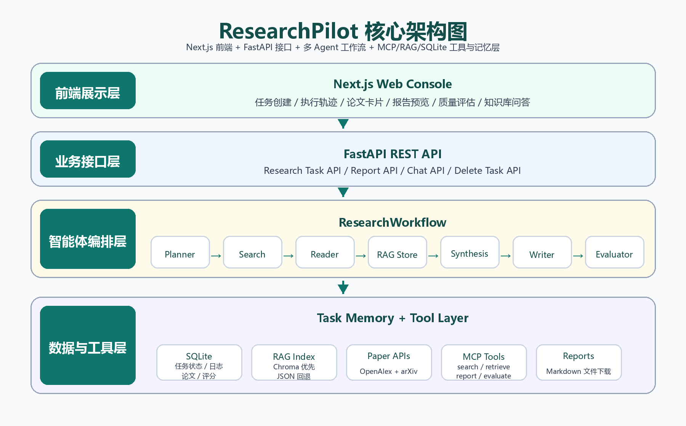
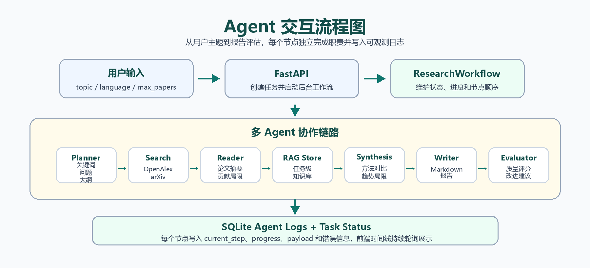
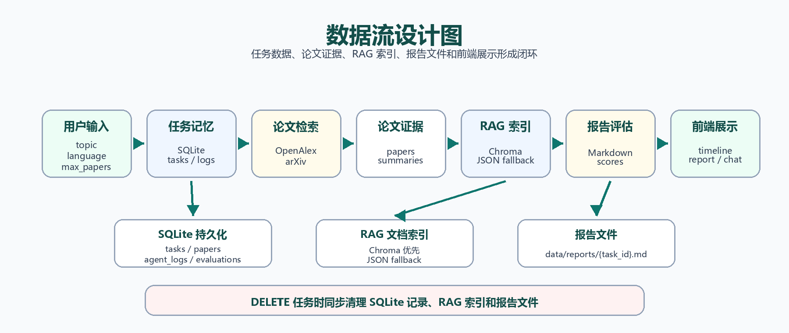

# ResearchPilot Architecture

ResearchPilot is organized as a three-layer Agentic AI research system: a Next.js web console, a FastAPI service layer, and a LangGraph-based agent execution layer with MCP-style tools and local retrieval memory.

## 1. Layered View

- Frontend layer: task creation, execution trace, paper cards, report preview, quality evaluation, and knowledge-base Q&A.
- API layer: task lifecycle APIs, report download APIs, chat APIs, and persistence coordination.
- Agent layer: Planner, Search, Reader, RAG Store, Synthesis, Writer, and Evaluator nodes orchestrated by LangGraph.
- Data/tool layer: OpenAlex paper search, SQLite task memory, local vector retrieval, report files, and configurable OpenAI-compatible LLM calls.

## 2. Agent Workflow

The workflow is intentionally sequential for the final course demo. This keeps the execution trace observable and stable while still showing multi-step reasoning, tool use, local memory, and evaluator feedback.

## 3. Data Flow

Research tasks start from a user topic. The system persists task metadata in SQLite, retrieves papers from external academic sources, stores summaries in the local retrieval index, writes Markdown reports to `data/reports/`, and returns report/evaluation content to the web UI.

## 4. Key Engineering Decisions

- Real API mode is used for the final demo. API keys are loaded from `.env` and are never committed.
- Runtime artifacts such as logs, SQLite databases, generated reports, vector cache files, `.next`, `node_modules`, and virtual environments are ignored by Git.
- The final PDF report is generated from Markdown using `scripts/build_cs599_report_pdf.py`, with diagrams and screenshots stored in `docs/assets/`.
- The code keeps the minimum viable production structure: typed schemas, route separation, agent nodes, retrieval service, database repository, and focused tests.
