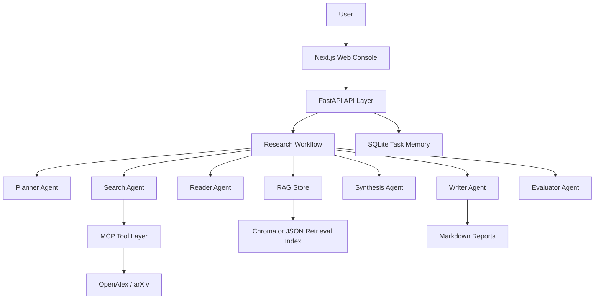
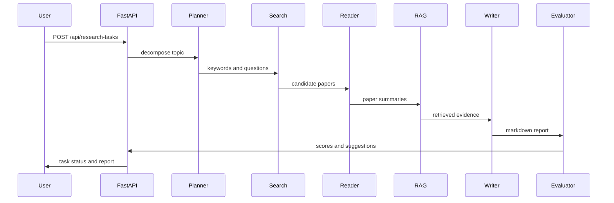

# Architecture Spec: ResearchPilot

## 1. 总体架构



## 2. 分层设计

### 前端展示层

- Next.js App Router。
- Tailwind CSS 和 shadcn/ui 风格组件。
- 通过轮询展示任务进度。
- Tabs 展示执行轨迹、论文、报告和评分。

### 业务接口层

- FastAPI 提供统一 REST API。
- SQLite 保存任务状态、论文、Agent 日志和评估结果。
- 后台线程执行 Agent 工作流。

### 智能体执行层

- 线性 LangGraph 风格工作流。
- 每个 Agent 节点只负责一个清晰职责。
- 工具能力通过 Python 函数和 MCP Server 暴露。

### 数据与记忆层

- SQLite: 任务记忆、状态、日志、论文元数据。
- Chroma: 优先作为向量库。
- JSON lexical retrieval: 用于保存任务级文档索引，支撑知识库问答。

## 3. Agent 流程



## 4. 状态模型

```text
created -> running/planner -> search -> reader -> rag_store -> synthesis -> writer -> evaluator -> completed
                                                           \-> failed
```

## 5. 可扩展点

- Search Agent 可增加 Semantic Scholar、Crossref、Google Scholar 适配器。
- Reader Agent 可接入 PDF 全文解析。
- Workflow 可从线性流程升级为条件路由、人工确认和反思重写。
- Evaluator 可替换为 RAGAS、DeepEval 或自定义 benchmark。
- Web 可加入 SSE 实时日志和团队协作。
